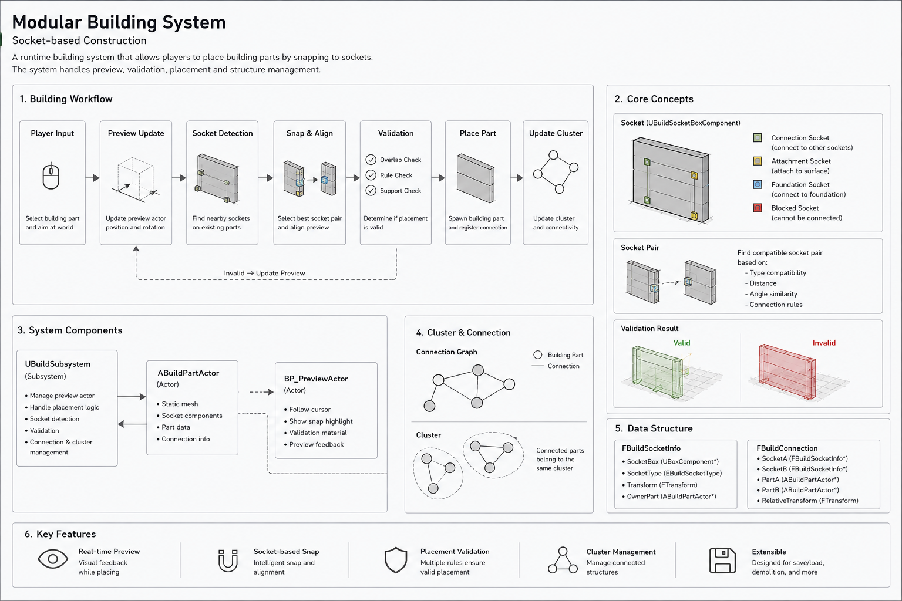

# Survival System Demo

## 🎥 System play Video

[

## **Tree Interaction System**

The world uses Unreal foliage instances for efficient rendering.

When a player interacts with a tree:

* The foliage instance is converted into a runtime `TreeActor`
* The actor supports chopping and falling behavior
* Distant trees are recycled back into foliage instances automatically

This approach keeps the world highly interactive while avoiding large numbers of active actors.

### **Highlights**

* Runtime foliage ↔ actor conversion
* Distance-based actor recycling
* Lightweight active actor management
* Efficient large-scale forest interaction

---

## **Modular Building System**

A socket-based modular building system for survival gameplay.

Players can:

* Preview structures before placement
* Snap building parts together
* Validate placement using overlap checks

The system is designed to support scalable base-building workflows while keeping placement logic modular and extensible.

### **Highlights**

* Real-time placement preview
* Snap-point based construction
* Placement validation
* Modular structure architecture

